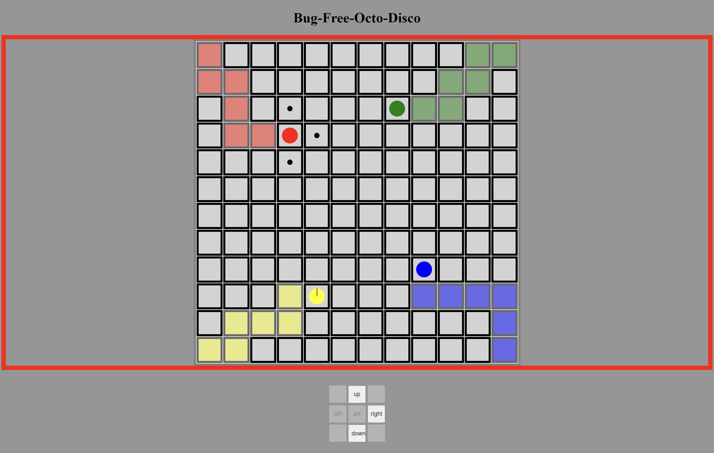

# Bug-Free-Octo-Disco

A simple board game, also the final project of the JavaScript Classes. I haven't thought of a cool name for this game yet, so now I'm using the default random repository name for now.

Here is the [online demo link](https://eric1050811-sc11.github.io/bug-free-octo-disco/).

## Rules

* 2 to 4 players
* Players move on a 12 by 12 grid
* Players start at the four corners
* In each round, players take turns to decide which direction they're going to move in, they have 5 second to make a decision. In each round, the player can only move one step. **Note that players can't move back to their previous positions, including their own and others**.
* When there are any player on the current player's cross (row or column), current player can decide whether to attack or keep moving. When the player decides to attack, it will generate a random number to decide whether the attack is successful or not.
* If the attack fails, the other player survives, but the current player is guaranteed that next attack will be 100% successful.
* The game ends when there is only one player still alive, or no one can make a move.

## UI Design Ideas

* Floating start menu and game ending message.
* The border of the game board indicates which player's round it is.
* The color of the blocks already traveled becomes the color of the player.
* If the player dies, the color of the block the player is currently on becomes black and no one can step on it.
* If the player has 100% attack guarantee, the border of the player becomes bolder.

## Controls

* Players can use buttons to control movement and attack, or they can just click on the block they want to move to.
* Working on better control experience.

## Code

* The project is written in HTML and JavaScript.
* Using the jQuery framework.
* Files:
  * index.html
  * main.css
  * script.js
* Environment:
  * System: Ubuntu on WSL2
  * Text Editor: VSCode
  * Execution: Live Server plugin on VSCode with Chrome
  * **Will be deploy on the Github Pages in the future**

## More ideas

1. Power-ups
2. Obstacles
3. Visual effect
4. Sound effect
5. Action log
6. More game modes
   * Survival mode: last one standing wins
   * Capture the flag: first one get to the flag wins
   * Mark the land: one with the biggest area marked wins
7. Code optimization

## Thought on this Project

我覺得這個 final project 蠻有趣的，從零開始設計遊戲，完程設計之後的 Coding 也蠻有挑戰性的，還有設計前端真的是一大挑戰(對我沒有設計感的人來說)。
