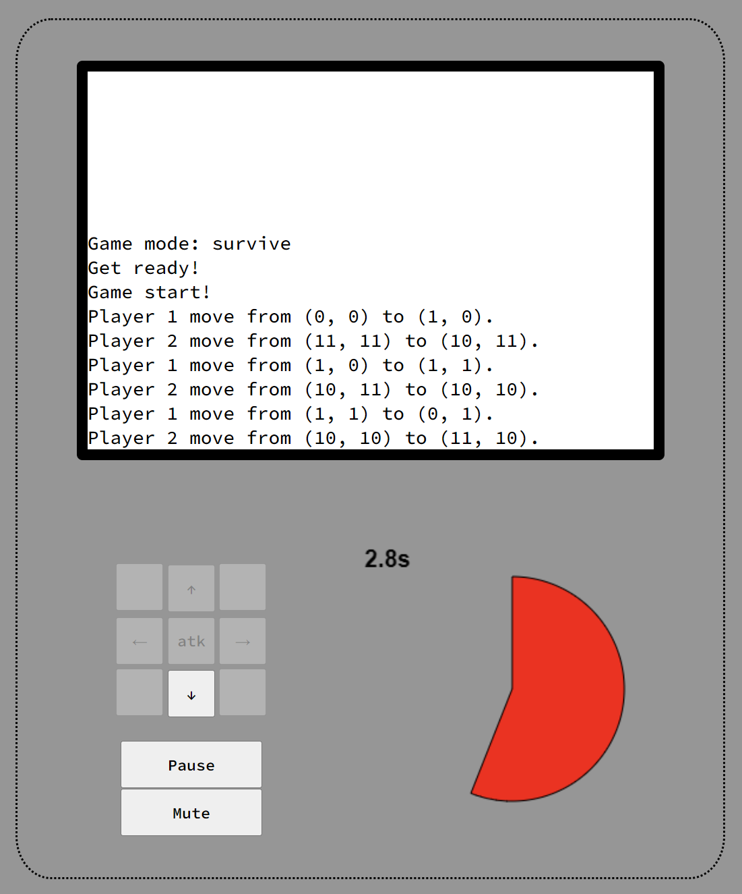

# Bug-Free-Octo-Disco

A simple board game, also the final project of the 112-2 JavaScript Classes in NYCU. I haven't thought of a cool name for this game yet, so now I'm using the default random repository name for now.

Here is the [online demo link](https://eric1050811-sc11.github.io/bug-free-octo-disco/).


## Basic rules

* 2 to 4 players
* 3 game modes
* Players move on a 12 by 12 grid.
* Players start at four corners.
* In each round, players take turns to decide which direction they're going to move in, they have 5 second to make a decision. In each round, the player can only move one step. **Note that players can't move back to their previous positions, including their own and others**.
* When there are any player on the current player's cross (row or column), current player can decide whether to **attack** or **keep moving**. When the player decides to attack, there is a probability that the attack will fail.
* If the attack fails, the other players survive, but the current player is guaranteed that next attack will be 100% successful.
* If the player can't move, his round will be skipped, but he can still attack if any enemy stands on his cross.
* After players take 20 rounds, the grid will start to generate obstacles (black boxes), one in a round.
* The game ends when there is only one player still alive, the flag has been captured or no one can make a move.

## More about game mode

* Survive
  * Last player stands on the grid wins.
  * If no one can move, the game ends, no one win.
  * Even if the player can't move, he can still attack if any enemy stands on his cross.
* Cap Flag
  * First player to reach the flag wins.
  * **Players can travel back to previous position.**
  * Players can still attack each other to fight for the flag.
* Area
  * When no one can move, players with the maximum area win.
  * Can have multiple winners.
  * **No attack.**

## UI, Sound and Controls Design

* Floating start menu, pause menu and game over message.

|  |  |  |
| :----: | :----: | :----: |
| start menu | pause menu | game over |

* Smooth animation on start. pause and game over.
* Player movement animation.
* The border of the game board indicates which player's round it is.
* The color of the blocks have been traveled becomes the color of the player.
* If the player dies, the color of the block the player is currently on becomes black and no one can step on it.
* If the player has 100% attack guarantee, the border of the player becomes white and bolder.
* The action log can track what happened on the grid.
* Big count down clock, also indicated which player's round.

|  |  |
| :----: | :----: |
| promised player | action log, control buttons <br> and count down clock |

* Players can use buttons to control movement and attack, or they can just click on the block they want to move to.

## Code

* Written in HTML and JavaScript.
* Using the jQuery framework.
* Files and Folders:
  * ./index.html
  * ./main.css
  * ./script.js
  * ./img
  * ./audio
* Environment:
  * System: Ubuntu on WSL2
  * Text Editor: VSCode
  * Execution: Live Server plugin on VSCode with Chrome
  * **Will be deploy on the Github Pages**

## Code explanation

### Topology

``` java
// define constants and initialize variables
$(document).ready()
├── draw_main_game_area();
├── draw_control_area();
├── disable_control();
├── $("body").click(...) // audio initialize
├── $(".num_player").click(...) // select number of players
├── $(".game_mode").click(...) // select game modes
└── $("#start").click(function() {game_start();})
    ├── get_num_of_player();
    ├── create_player();
    ├── draw_timer();
    ├── gen_flag(); // if game_mode = "cap flag"
    ├── a_round();
    │   ├── disable_controls();
    │   ├── enable_controls();
    │   │   ├── indicate();
    │   │   └── attack();
    │   ├── gen_obstacle(); // if total_round > 20
    │   ├── next_round();
    │   │   ├── is_game_over();
    │   │   │   ├── declare_winner();
    │   │   │   ├── no_one_can_move();
    │   │   │   └── calculate_area();
    │   │   └── a_round();
    │   ├── clearInterval();
    │   └── set_mainInterval();
    │       └── next_round()
    ├── $("#pause").click(...);
    ├── $("#mute").click(...);
    ├── $("#resume").click(...);
    └── $("#restart").click(...);
```

Code inside `script.js` is comment carefully. If you need more detailed explanation, check out `script.js`.  

Here I list the two most important function: `a_round()` and `next_round()`  

```java
function a_round(player_id) {
    // double check current player is still alive
    if (out_player.includes(player_id)) {
        next_round();
        return;
    }

    // check current player still can move
    if (cant_move.includes(player_id)) {
        let msg = "Player " + player_id + " can't make any move.<br>";
        update_action_log(msg);

        if (enable_controls(player_id) && game_mode != "area") { // area no attack
            let msg = "But player " + player_id + " has a chance to attack.<br>";
            update_action_log(msg);
        }
        else {
            next_round();
            return;
        }
    }

    // change the border color
    $("#main_game_area").css("border-color", COLOR[player_id]);

    // reset and enable control
    disable_controls();
    enable_controls(player_id);

    // generate obstacle when total round > 20
    if (total_round > 20) {
        gen_obstacle();
    }

    // main 5 second interval
    clearInterval(mainInterval);
    set_mainInterval(player_id);
}
```

```java
function next_round() {
    // check if game over first
    let game_status = is_game_over(game_mode);
    if (game_mode == "survive") {
        if (game_status == 1) {
            declare_winner("");
            return;
        }
        else if (game_status == 2) {
            no_one_can_move();
            return;
        }
    }
    else if (game_mode == "cap flag") {
        let temp = game_status / 100; 
        if (temp >= 1 && temp <= player_num) {
            declare_winner(temp);
            return;
        }
    }
    else { // area
        if (game_status == 1000) {
            calculate_area();
            return;
        }
    }

    // move to next player, exclude the player already dead or can't move
    do {
        round++;
        total_round++;
        if (round > player_num) {
            round = 1;
        }
    } while (out_player.includes(round));

    disable_controls();
    enable_controls(round);

    // reset timer
    sec = 5;
    $("#5sec_timer").html(sec);
    draw_timer(sec, COLOR[round]);

    // start a five second round
    a_round(round);
}
```

These two functions are the core of the whole board game. They check:  

1. if game can go on or not
2. a 5 sec round for each player
   * if can't move or died
   * possible moving direction
   * if can attack
   * player movement and attack
   * update status of the player
   * timer update

Due to these two functions, the whole game can work.

## More ideas

1. Obstacles (done)
2. Visual effect (animation) (done)
3. Sound effect (done)
4. Action log (done)
5. More game modes (done)
   * Survival mode: last one standing wins
   * Capture the flag: first one reach the flag wins
   * Mark the land: one with the biggest area marked wins
6. Code optimization
7. Game Pause (done)

## To do in the future

1. Code optimization
2. Better UI design
3. Minor bug fix

## Thought of this Project

我覺得這個 final project 蠻有趣的，從零開始設計遊戲，完程設計之後的 Coding 也蠻有挑戰性的，還有設計前端真的是一大挑戰(對我沒有設計感的人來說)。

## Credits

### image

`flag.png`: https://www.flaticon.com/free-icon/flag_9709603

### audio

`clock_a_sec.wav`: https://sc.chinaz.com/yinxiao/180924548891.htm  
`bgm.mp3`: https://kenkenbgm.blogspot.com/2023/11/bgmbgmroyalty-free-music316first-day.html  
`move.mp3`: https://taira-komori.jpn.org/game01tw.html `jump09`  
`atk.mp3`: https://taira-komori.jpn.org/human01tw.html `fart1`  
`atk_fail.mp3`: https://taira-komori.jpn.org/human01tw.html `gasp1`  
`win.wav`: https://sc.chinaz.com/yinxiao/150720069662.htm  
`go.wav`: https://sc.chinaz.com/yinxiao/120713546050.htm  
`game_over.wav`: https://sc.chinaz.com/yinxiao/200724077310.htm  
